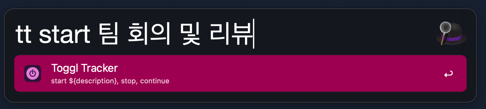
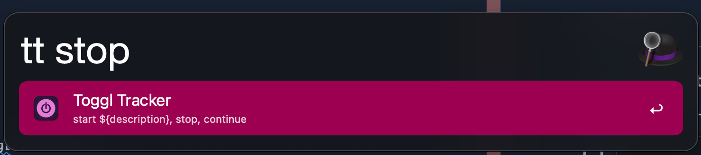
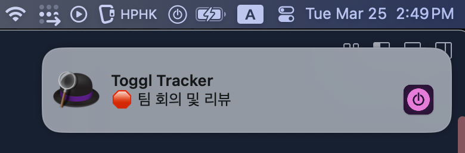
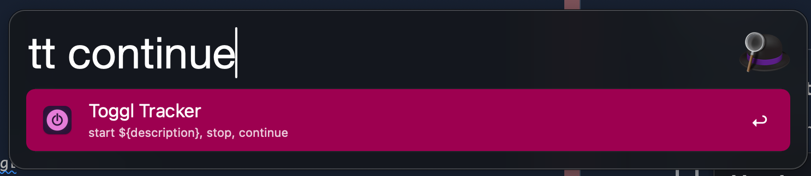

[toggl track](https://toggl.com/)을 alfred에서 좀 더 유용하게 쓰기 위함

## ScreenShot

### tt start {description}

- alfred command

- alfred notification & toggl track icon

### tt stop
- alfred command

- alfred notification & toggl track icon

### continue
- alfred command

- alfred notification & toggl track icon
